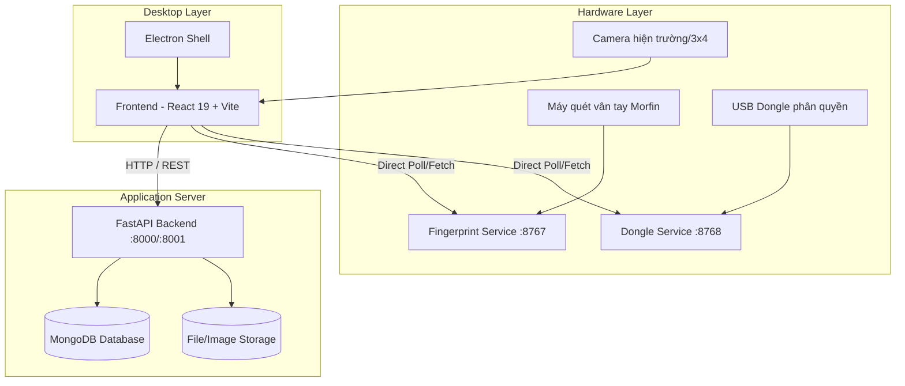
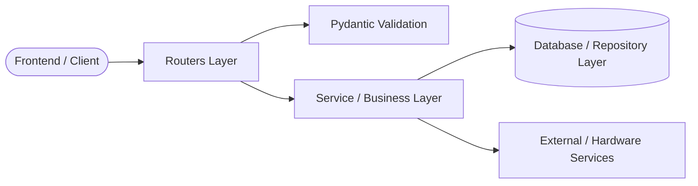
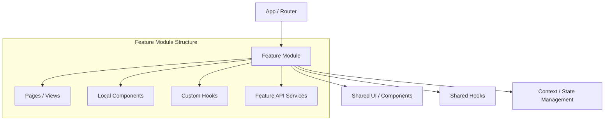

# KIẾN TRÚC HỆ THỐNG (SYSTEM ARCHITECTURE)
## Dự án: Hệ thống Quản lý Hồ sơ Căn phạm & Hiện trường (Vali Hiện Trường)

---

## 1. Tổng quan Kiến trúc (High-Level Architecture)

Hệ thống được thiết kế theo mô hình **Client - Server kết hợp Desktop & Hardware Layer**:
- **Desktop/Shell**: Electron đóng vai trò vỏ ứng dụng Desktop, quản lý cửa sổ Kiosk, quyền truy cập phần cứng cục bộ.
- **Frontend**: Single Page Application (SPA) xây dựng trên **React 19 + Vite**, thiết kế giao diện theo hệ thống Design System tối ưu cho màn hình cảm ứng & thao tác cán bộ nghiệp vụ.
- **Backend API**: REST API xây dựng trên **FastAPI (Python)**, giao tiếp bất đồng bộ, cung cấp các endpoint quản lý vụ án, hồ sơ, đối sánh và tích hợp.
- **Hardware Integration Layer**: Các tiến trình dịch vụ phần cứng chạy độc lập trên các cổng chuyên biệt (Service vân tay Morfin `:8767`, Service USB Dongle `:8768`, Camera,...).
- **Database**: **MongoDB** lưu trữ hồ sơ đối tượng, vụ án, dấu vết hiện trường, ảnh base64/URL và lịch sử đồng bộ.



---

## 2. Cấu trúc thư mục chuẩn hóa (Standard Directory Structure)

### 2.1 Cấu trúc tổng thể toàn bộ Repo
```text
vali_hientruong/
├── backend/                  # FastAPI Backend Server
│   ├── core/                 # Cấu hình hệ thống, bảo mật, biến môi trường
│   ├── db/                   # Kết nối MongoDB, Collections, Migrations
│   ├── schemas/              # Pydantic Schemas (Request/Response validation)
│   ├── routers/              # API Endpoints (tách theo nghiệp vụ)
│   ├── services/             # Business Logic & Dịch vụ ngoại vi
│   ├── utils/                # Hàm tiện ích dùng chung
│   ├── uploads/              # Thư mục lưu trữ tệp tin/ảnh upload cục bộ
│   ├── main.py               # Entrypoint khởi tạo FastAPI App & Middleware
│   ├── requirements.txt      # Dependencies Python
│   └── tests/                # Unit & Integration Tests (pytest)
│
├── frontend/                 # React 19 + Vite Web Application
│   ├── src/
│   │   ├── api/              # Axios / Fetch HTTP API Clients theo domain
│   │   ├── assets/           # Static assets, SVG, icons, images
│   │   ├── components/       # UI Components dùng chung toàn ứng dụng
│   │   ├── features/         # Module hóa theo từng màn hình/nghiệp vụ chính
│   │   │   ├── auth/         # Đăng nhập, phân quyền, USB Dongle check
│   │   │   ├── cases/        # Quản lý danh sách & chi tiết vụ án
│   │   │   ├── capture/      # Thu nhận hồ sơ, ảnh 3x4, vân tay 10 ngón
│   │   │   ├── scene_traces/ # Phân tích, so khớp dấu vết hiện trường
│   │   │   ├── history/      # Lịch sử hồ sơ & Lịch sử đồng bộ USB/Server
│   │   │   ├── users/        # Quản trị người dùng & phân quyền
│   │   │   └── settings/     # Cài đặt ngưỡng, cấu hình thiết bị
│   │   ├── hooks/            # Custom React Hooks dùng chung
│   │   ├── locales/          # Đa ngôn ngữ (vi.json, en.json)
│   │   ├── styles/           # CSS Tokens, Animations, Theme, Layouts
│   │   ├── utils/            # Helper format ngày tháng, validation, convert
│   │   ├── App.jsx           # Root App Component & Router/Page Switcher
│   │   └── main.jsx          # Entrypoint React
│   ├── index.html
│   ├── package.json
│   └── vite.config.js
│
├── electron/                 # Electron Desktop wrapper
│   ├── main.cjs              # Electron Main Process
│   └── preload.cjs           # Preload script (bảo mật context bridge)
│
├── docs/                     # Tài liệu thiết kế & quy chuẩn kỹ thuật
│   ├── ARCHITECTURE.md       # Tài liệu kiến trúc này
│   └── CODING_STANDARDS.md   # Quy chuẩn code & phong cách lập trình
│
└── scripts/                  # Scripts khởi động, tắt và quản trị hệ thống
    ├── run.ps1               # Khởi động toàn bộ dịch vụ
    ├── stop.ps1              # Dừng toàn bộ tiến trình
    └── start-services.ps1    # Khởi động riêng lẻ các service
```

---

## 3. Kiến trúc chi tiết các tầng (Layered Architecture Details)

### 3.1 Backend Architecture (FastAPI)

Áp dụng mô hình **Routers - Services - Repositories/DB**:



1. **Routers (`backend/routers/`)**:
   - Chỉ chịu trách nhiệm nhận HTTP Request, validate schema đầu vào qua Pydantic, gọi hàm service tương ứng và trả về HTTP Response + Status code chuẩn.
   - Không viết truy vấn database trực tiếp hoặc xử lý logic nghiệp vụ phức tạp tại Router.
   - Các router chính:
     - `auth.py`: Đăng nhập, cấp JWT token, xác thực USB Dongle.
     - `cases.py`: CRUD vụ án hiện trường.
     - `detainees.py`: Quản lý hồ sơ đối tượng / can phạm.
     - `scene_traces.py`: Dấu vết hiện trường và thuật toán so khớp.
     - `sync.py`: Xuất/nhập gói dữ liệu đồng bộ qua USB hoặc Server.
     - `system.py`: Kiểm tra trạng thái thiết bị, thông tin cấu hình, logs.

2. **Services (`backend/services/`)**:
   - Chứa toàn bộ Business Logic, tính toán đối sánh, xử lý tệp tin, xuất bản biểu mẫu in (PDF/Docx), liên kết thiết bị.
   - Đảm bảo tính tái sử dụng và dễ viết Unit Test độc lập.

3. **Schemas (`backend/schemas/`)**:
   - Sử dụng **Pydantic v2** (`BaseModel`, `Field`, `validator`/`field_validator`).
   - Tách biệt rõ ràng: `CreateSchema`, `UpdateSchema`, `ResponseSchema`.

4. **Database & Core (`backend/db/`, `backend/core/`)**:
   - `core/config.py`: Đọc cấu hình từ `.env` bằng `pydantic-settings`.
   - `core/security.py`: Mã hóa mật khẩu (bcrypt), sinh & giải mã JWT Token.
   - `db/mongo.py`: Quản lý MongoDB Connection Pool (Motor/PyMongo), đảm bảo cơ chế retry và indexes.

---

### 3.2 Frontend Architecture (React 19 + Vite)

Áp dụng mô hình **Feature-Based Architecture (Module hóa theo tính năng)**:



1. **Features (`frontend/src/features/`)**:
   - Mỗi thư mục tính năng là một đơn vị độc lập chứa:
     - `components/`: Các component giao diện chỉ dùng riêng cho tính năng này.
     - `hooks/`: State logic, async data fetching của tính năng.
     - `api.js`: Các API request phục vụ riêng cho tính năng.
     - `index.js` hoặc `*Page.jsx`: View chính của tính năng.
2. **Shared Components (`frontend/src/components/`)**:
   - Chứa các UI components dùng chung: `Button`, `Modal`, `Input`, `Toast`, `Table`, `Badge`, `Card`.
   - Thiết kế chuẩn Design System, hỗ trợ Dark/Light Theme và tối ưu Accessibility.
3. **Data Fetching & State Management**:
   - Không nhồi nhét state toàn cục nếu chỉ phục vụ cục bộ một trang.
   - Sử dụng Custom Hooks kết hợp `useCallback`, `useMemo` và AbortController để tránh rò rỉ bộ nhớ (memory leaks) khi unmount.
4. **i18n & Localization**:
   - Toàn bộ text hiển thị phải thông qua hệ thống `useI18n()` và từ điển `src/locales/vi.json` / `src/locales/en.json`.

---

## 4. Giao thức Tích hợp Phần cứng (Hardware Integration)

| Thiết bị | Cổng / Giao thức | Tiến trình phụ trách | Cách thức giao tiếp |
| :--- | :--- | :--- | :--- |
| **Máy quét vân tay Morfin** | `http://127.0.0.1:8767` | `backend/services/morfin_server.py` | Frontend gọi trực tiếp REST / SSE kiểm tra status & nhận kết quả quét |
| **USB Dongle phân quyền** | `http://127.0.0.1:8768` | `backend/services/dongle_server.py` | Kiểm tra chữ ký phần cứng lúc đăng nhập & ký dữ liệu |
| **Camera hiện trường / 3x4** | WebRTC / Canvas Video Stream | Trình duyệt / Electron Web API | Chụp ảnh độ phân giải cao, nén JPEG, upload về Backend |

---

## 5. Lộ trình Refactor Module hóa (Refactoring Roadmap)

Để chuyển đổi an toàn từ cấu trúc file nguyên khối (Monolith files: `Dashboard.jsx`, `main.py`) sang cấu trúc module hóa chuẩn:

- **Giai đoạn 1 (Backend Modularization)**:
  1. Tách `backend/main.py` thành các routers chuyên biệt trong `backend/routers/`.
  2. Gom các Pydantic models vào `backend/schemas/`.
  3. Gom các hàm database vào `backend/db/`.
- **Giai đoạn 2 (Frontend Separation)**:
  1. Tách các trang bên trong `Dashboard.jsx` thành từng page độc lập trong `frontend/src/features/`.
  2. Rút gọn `DataCapturePage.jsx` bằng cách chuyển các phần quản lý thiết bị vân tay sang Custom Hook `useFingerprintEnroll`.
  3. Chuẩn hóa `App.jsx` làm shell điều hướng chính.
- **Giai đoạn 3 (Quality Gate & Testing)**:
  1. Thiết lập CI linter tự động (`oxlint` cho JS, `ruff` cho Python).
  2. Bổ sung Unit test cho các luồng nghiệp vụ cốt lõi (tạo vụ án, thu nhận vân tay, xuất báo cáo).
